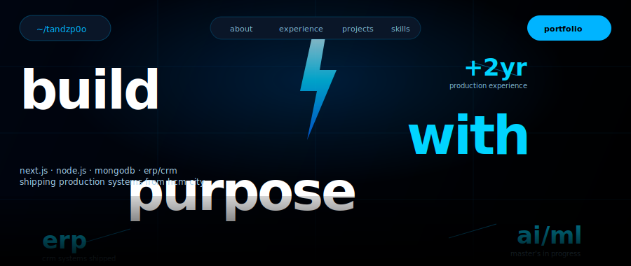

<div align="center">





<br>


<br><br>

[](https://git.io/typing-svg)

<br>

[](https://github.com/tandzp0o)
[](https://ltttan-portfolio.vercel.app/)
[](mailto:tannguyen0916@gmail.com)
[](https://www.facebook.com/trongtan.le.18)

<br><br>

### github analytics


<br>


<br>


<br>


<br>


</div>

---

<details open>
<summary><b>about</b></summary>
<br>

software developer specializing in **next.js, react, node.js and mongodb**, with a strong background in building and deploying erp/crm systems end-to-end — from requirement analysis through to production on vercel. currently pursuing a master's degree in information technology with a focus on ai/ml models and algorithm optimization.

</details>

<details open>
<summary><b>git log --experience</b></summary>
<br>

```text
* HEAD -> main   (Jan 2026 – Jul 2026)  Wows — R&D
│   + Developed and deployed ERP/CRM modules using Next.js (App Router), Node.js, MongoDB
│   + Handled user workflows, forms and real-time data operations
│   + Collaborated with clients on requirement gathering, training and troubleshooting
│   + Integrated APIs and optimized database queries for performance
│
* (Apr 2025 – Oct 2025)  Mạng Xuyên Việt — Developer
    + Built and maintained ASP.NET WebForms applications
    + Integrated frontend with backend and SQL Server
    + Implemented features based on client requirements, with a focus on performance
```

</details>

<details open>
<summary><b>projects</b></summary>
<br>

| | project | stack | highlights |
|:---:|:---|:---|:---|
| 🏢 | **erp / business websites** |     | erp/business features, forms, workflows, database ops |
| 🧪 | **experimental center management** |     | responsive management interfaces |

</details>

<details open>
<summary><b>skills</b></summary>
<br>

| frontend | backend | database | tools |
|:---:|:---:|:---:|:---:|
|  |  |  |  |
|  |  |  |  |
|  |  |  |  |
|  | | |  |
|  | | | |

</details>

<details open>
<summary><b>education</b></summary>
<br>

🎓 **hcm city university of industry and trade** — master's degree in information technology *(thesis & final defense in progress)*

</details>

<div align="center">

<br>


</div>
